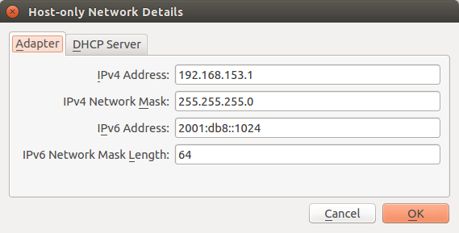
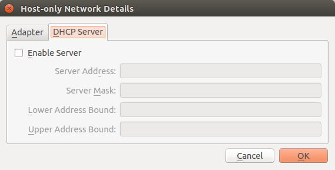
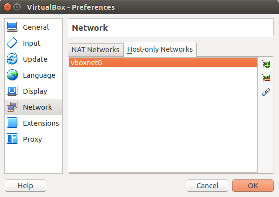
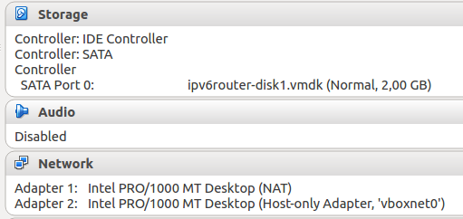
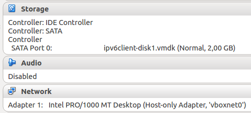

# IPv6 Training VirtualMachines
The VMs in this repository can be used to set up a simple IPv6 environment to test with on [VirtualBox](https://www.virtualbox.org/).

With these VMs a simple setup can be created to play with IPv6 and understand how the basics work.

These Virtual Machines are used by [42on B.V.](http://www.42on.com/) for IPv6 training.

All VMs in this environment will be running Ubuntu Linux.

The setup consists out of two types of VMs:

- Router
- Client

The *router* will run the following software/components:

- [radvd](http://www.litech.org/radvd/) for Stateless AutoConfiguration ([SLAAC](https://tools.ietf.org/html/rfc4862)) of clients
- [Unbound](https://www.unbound.net/) for a DNS server
- [Apache HTTPd](https://httpd.apache.org/) as a HTTP proxy server for the clients (only needed in this test)

With these VMs you will be able to experiment with a working IPv6 setup in a small lab environment and experience how the IPv6 protocol behaves differently then IPv4.

The *client* is just a plain Linux operating system where you can see how a client obtains an address and can communicate with it.

# Prerequisites
To run this Virtual Machines you need to match the following requirements:

- VirtualBox >4.X installed
- 10GB of free diskspace
- 2GB of memory

# Configure VirtualBox
Before you can inport the Virtual Machines you have to make sure that a *Host-Only* network is created.

Usually there is no such network on the system by default, so you can create one which will have the name *vboxnet0*.

Go to the VirtualBox preferences and create a Host-Only network.

When creating use the following IPv4 and IPv6 settings:



And make sure DHCP is **not** enabled:



After you create the network you should have the following overview. *vboxnet0* should now exist.



# Importing Virtual Machines
You can import the *router* and *client* Virtual Machines in VirtualBox using their **.ovf** file.

After you import them, make sure that the network settings described below are applied to them.

## Router
For optimal usage the router needs internet access. We do this by providing two network cards to the Router:

- NIC 1: NAT
- NIC 2: Host-Only network *vboxnet0*

Using the *NAT* NIC it will have access to the internet.



## Client
The client just needs to be connected to the router over the Host-Only network.

The NIC of the client needs to be connected to *vboxnet0*.



# Starting
You can now start the Virtual Machines where it is best to start the router first.

After 30 seconds start the client.

# Logging in
After boot you can log in with these credentials:

- User: root
- Password: ipv6test

## SSH
From the machine where the Virtual Machines are running on you should be able to connect through SSH using your favorite SSH client.

Under Linux and Mac OSX you can use the *ssh* command on the command-line and on Windows [PuTTY](http://www.putty.org/). might be a good solution.

The **router** has a static IPv6 address: *2001:db8::1*

The *client* however obtains a dynamic IPv6 address. Log in through the terminal first and run:

```
root@ipv6client:~# ip addr show
1: lo: <LOOPBACK,UP,LOWER_UP> mtu 65536 qdisc noqueue state UNKNOWN group default qlen 1
    link/loopback 00:00:00:00:00:00 brd 00:00:00:00:00:00
    inet 127.0.0.1/8 scope host lo
       valid_lft forever preferred_lft forever
    inet6 ::1/128 scope host
       valid_lft forever preferred_lft forever
2: enp0s3: <BROADCAST,MULTICAST,UP,LOWER_UP> mtu 1500 qdisc pfifo_fast state UP group default qlen 1000
    link/ether 08:00:27:48:42:67 brd ff:ff:ff:ff:ff:ff
    inet6 2001:db8::a00:27ff:fe48:4267/64 scope global mngtmpaddr dynamic
       valid_lft 86398sec preferred_lft 14398sec
    inet6 fe80::a00:27ff:fe48:4267/64 scope link
       valid_lft forever preferred_lft forever
root@ipv6client:~#
```

In this case *2001:db8::a00:27ff:fe48:4267* is the IPv6 address of the client. Keep in mind, this address will be different in your situation.

# Components
On the router most components are installed. This was briefly explained at the beginning of this README.

## Router
The router has a 2nd network card which is attached to the Host-Only network *vboxnet0*.

### Interface configuration
Under Ubuntu this interface is called *enp0s8* and this interface is configured in */etc/network/interfaces*:

```
auto enp0s8
iface enp0s8 inet6 static
    address 2001:db8::1
    netmask 64
```

### Router Advertisements
The [Router Advertisement](https://en.wikipedia.org/wiki/Neighbor_Discovery_Protocol) Daemon radvd will send out advertisements for the subnet *2001:db8::/64* as configured in */etc/radvd.conf*:

```
interface enp0s8
{

	MinRtrAdvInterval 5;
	MaxRtrAdvInterval 60;
	AdvSendAdvert on;
        AdvOtherConfigFlag on;
        IgnoreIfMissing off;

	prefix 2001:db8::/64 {
	};

    RDNSS 2001:db8::1 {
    };
};
```

Next to the subnet it also announces that *2001:db8::1* can be used as a DNS server.

### DNS
In this case Unbound is used as a DNS server and allows queries from 2001:db8::/32. It is configured in */etc/unbound/unbound.conf.d/forward.conf*:

```
server:
    interface: ::1
    interface: 127.0.0.1
    interface: 2001:db8::1

    access-control: 127.0.0.0/8 allow
    access-control: ::1/128 allow
    access-control: 2001:db8::/32 allow
```

This allows the client to perform DNS lookups which it sends to the router.

### Proxy
The client also needs to be able access IPv4-only HTTP repositories for things like Apt and maybe other tools.

To allow that the Apache Webserver is running as a forward-proxy as configured in */etc/apache2/sites-enabled/proxy.conf*:

```
<VirtualHost *:80>
  ProxyRequests On
  ProxyVia On

  <Proxy "*">
    Require ip 2001:db8::/32
  </Proxy>
</VirtualHost>
```

## Client
The client has a rather straight forward configuration. It has only *one* NIC which is connected to *vboxnet0*.

### Interface configuration
The interface configuration of the client is simple and can be found in */etc/network/interfaces*:

```
auto lo
iface lo inet loopback

auto enp0s3
iface enp0s3 inet6 auto
```

*enp0s3* is configured for IPv6-only and will use Stateless AutoConfiguration (SLAAC) to configure the interface.

### Apt proxy
To allow Apt to function a HTTP proxy is configured in */etc/apt/apt.conf.d/80proxy*:

```
Acquire::http::Proxy "http://[2001:db8::1]";
```

All HTTP requests done by Apt will be proxied through the Apache Webserver proxy on the router.

# Tips and Tricks
A few things to do which might be interesting to see and learn from.

### Watch client discovery traffic
Make sure the client is turned off and run this command on the router:

``tcpdump -n -i enp0s8 -vvv -n``

Now start the client and watch how the traffic flows and how the client obtains it's address.

### Watch Router Advertisements
Run the following command on the client:

``tcpdump -n -i enp0s3 -vvv -n``

Wait at least 60 seconds and you should see a Router Advertisements come along from the router send by *radvd*.

## Ask for a Router Advertisement
On the client we can ask for a Router Advertisement with a Router Sollication. Run this command:

``ndisc6 enp0s3``

# Building
If you want to build these Virtual Machines from source you can do so by running the *build-all.sh* script in the *vms* directory.

You need to make sure that [Packer](https://www.packer.io/) is installed as it's used for building the images.
